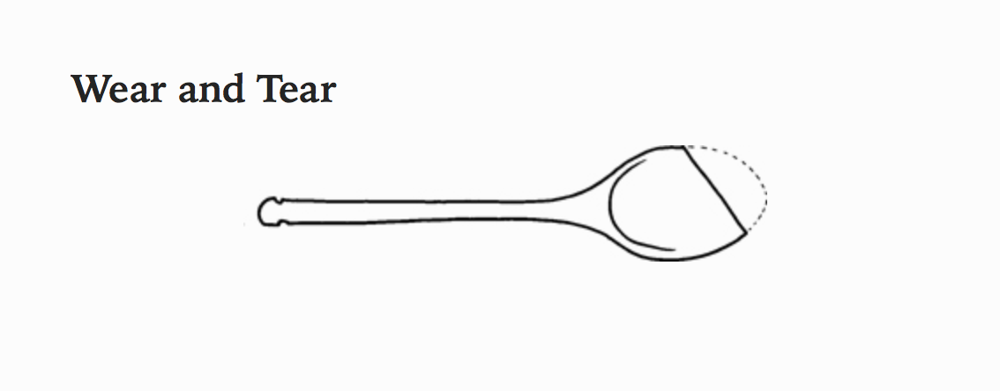

# Selected Quotations 

### Scott Kelly
> We had a saying in the Navy: ‘Better is the enemy of good enough,’

### Dieter Rams

> My intention is to omit every unneeded element in order to place the
> essentials in the foreground. Forms will then become placid, soothingly
> comprehensible, and long-lasting.

> Our electrical appliances should be humble servants, to be seen and heard as
> little as possible. They should ideally stay in the background, like a valet
> in the old days, that one hardly noticed

> We are economical with form and color, prioritize simple forms, avoid
> unnecessary complexity, do without ornament. Instead there is order and
> clarification. We measure every detail against the question of whether it
> serves function and facilitates handling

### Bruno Munari

> We have (though not all at once, of course) eaten the missing part mixed up in
> our soup. It is continual use that has given the spoon its new shape. This is
> the shape the saucepan has made by constantly rubbing away at the spoon until
> it eventually shows us what shape a spoon for stirring soup should be.

### Diamond Age

> “Which path do you intend to take, Nell?” said the Constable, sounding very interested. “Conformity or rebellion?”
> “Neither one. Both ways are simple-minded- they are only for people who cannot
> cope with contradiction and ambiguity”.

### Hackers pg 159
> I had some proscription against having fun. I was not allowed to have fun.
> The fun was in my work… It was if my way of asserting potency was to be able
> to build things that worked.

### Asterios Polyp
> Yes try try. Am I forever to be sabotaged by good intentions?

