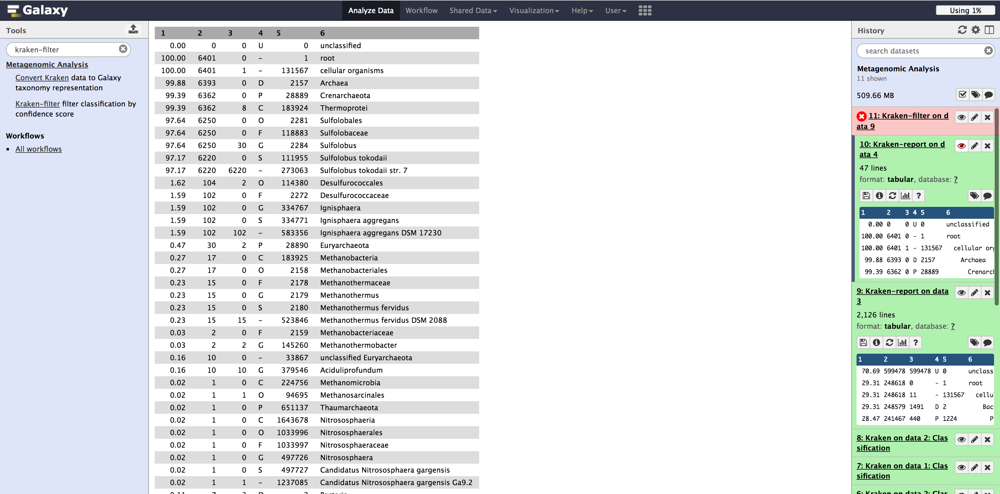
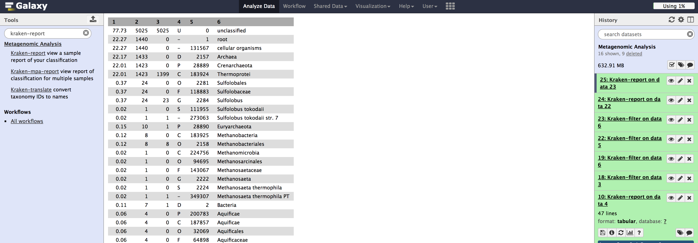
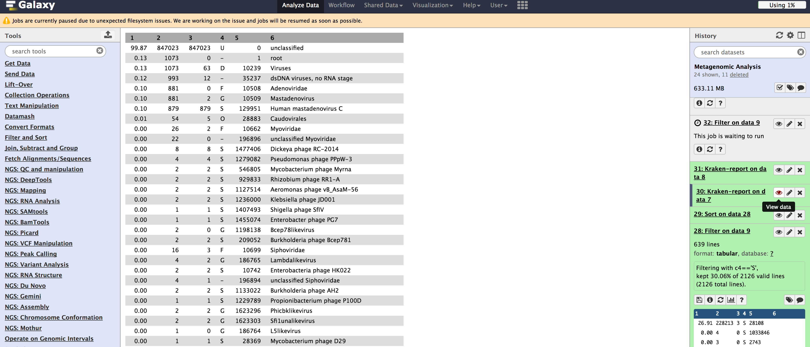

# Using Kraken on Galaxy

## Brief Introduction 

Today, we will introduce Kraken, a tool for metagenomic classification. Kraken
attempts to address the speed performance shortcomings of BLAST, and the
sensitivity shortcomings of MetaPhlAn. In order to focus on the application
itself instead of potential installation and configuration hurdles, we will be
using Galaxy to conduct this tutorial.

To begin, we will find datasets from two different sequencing platforms, one from
454, and another from Illumina. NCBI BioProject and NCBI SRA, a sequence read data archive,
are practical resources to use for obtaining metagenomic, among other, data. 

## Selecting Metagenomic Data for Use

1. In your favorite web browser (preferably one that respects your privacy and digital freedom), navigate to the [BioProject Browse Page](https://www.ncbi.nlm.nih.gov/bioproject/browse/).
2. Under the `Project Data Type` menu, select `Metagenome`.
3. The author of this tutorial is not particularly anthroprocentric, and does enjoy relaxation, so let us choose the hot springs metagenome project.
4. In order to give us more flexibility in selecting runs to use, let us use the parent project PRJNA20821

We will use the following datasets for the rest of the tutorial.
* [SRR3050168 Illumina WGS Run](https://www.ncbi.nlm.nih.gov/sra/SRX1499016[accn])
* [SRR2968624 16s 454 Run](https://www.ncbi.nlm.nih.gov/sra/SRX1458051[accn])

## Using Kraken on Galaxy
1. Create a new history and rename it to Metagenomic Analysis
2. Click `Extract reads (FASTQ)` on the left hand side under NCBI SRA Tools. If you have trouble finding it, you can always search for it in the "search tools" section.
3. Once you have retrieved your reads from NCBI SRA, rename them on the right hand side so that you don't confuse yourself later. If you don't, please google HXB2 contamination to see what happens when you are careless about labeling.
4. Under `Metagenomic Analysis`, select `Kraken`.
- Since we are looking at hot spring data, we are most likely interested in bacterial diversity.
- We will select the quick operation due to the minimal loss in sensitivity for greatly increased gain in speed.

## Kraken Report Tool

The raw output from Kraken is a bit unwieldy to work with, so we will want to
use tools like Kraken Report.

1. Click the search field on the left hand side of Galaxy
2. Search "kraken-report"
3. Select the Kraken output you wish to receive a report for
4. Run and profit

Let's take a look at the top hits

First, we must be able to interpret each column
1. Percentage of reads covered by the clade rooted at this taxon
2. Number of reads covered by the clade rooted at this taxon
3. Number of reads assigned directly to this taxon
4. A rank code, indicating (U)nclassified, (D)omain, (K)ingdom, (P)hylum, (C)lass, (O)rder, (F)amily, (G)enus, or (S)pecies. All other ranks are simply '-'.
5. NCBI taxonomy ID
6. indented scientific name

We can see that of the species classified, 228210 were Alteromonas macleodii str. 'Ionian Sea U8'. 
599478 was not classified at all.

454 Results

With the 454 dataset, we see that Kraken was able to classify 97.17% as Sulfolobus tokodaii str. 7.

## Kraken Filtering Options

We can also use Kraken filtering options select the most abundant classifications according to rank code.

1. Click the search field on the left hand side of Galaxy
2. Search "kraken-filter"
3. Select the original Kraken dataset
4. Run kraken-report on resulting filtered dataset

Kraken filters using scores. A sequence label's score is a fraction C/Q, where C
is the number of k-mers mapped to LCA values in the clade rooted at the label,
and Q is the number of k-mers in the sequence that lack an ambiguous nucleotide
(i.e., they were queried against the database).

Notice that the results are not as granular, and that we lose quite a bit of classification, by setting the filtering score to .2

Filtering on 454 data isn't as drastic, but it is still substantial

If we elect to filter and sort data using Galaxy, we can use filter based on
column 4 (the rank code), and then select sort on number of reads covered by the
clade rooted at the taxon. An example using species on the Illumina dataset is
shown below:

And if we sort by Family (please note you want to sort by the *second* column)
<!---->

I do not have a screenshot of this due to the Galaxy site being unavailable on
Tuesday 20170509.

## Questions to Ponder

### The importance of knowing the source of your data
One question that we must keep in mind when doing metagenomic analysis is what
sort of machine and method was used to sequence the data in the first place. We
can see how much more successful Kraken was at identifying the 16S results. This
is because the 16S rRNA gene is highly conserved across different species of
bacteria and archaea.

Please note that this conclusion is *not* universal, and it depends on the
*context* of the experiment you are conducting. Despite increased depth with 16s
sequencing, the researcher is potentially sacrificing signal in detecting a
wider range of bacterial diversity. I urge the reader to read journal
publications discussing the strengths and limitations of both methods.

### Additional Kraken Parameters

Please consider the Kraken database you select when using the application. 
Notice that you will not classify data accurately at all if you are using the
wrong database.

Illumina Wrong Reference Database

454 Wrong Reference Database

Unfortunately, Galaxy does not report how long each job takes, so we cannot
compare the times between the quick operation and Kraken original. We can,
however, notice that the classification difference is minimal. If you are in a
rush, you may want to choose the quick operation for little cost in sensitivity.

